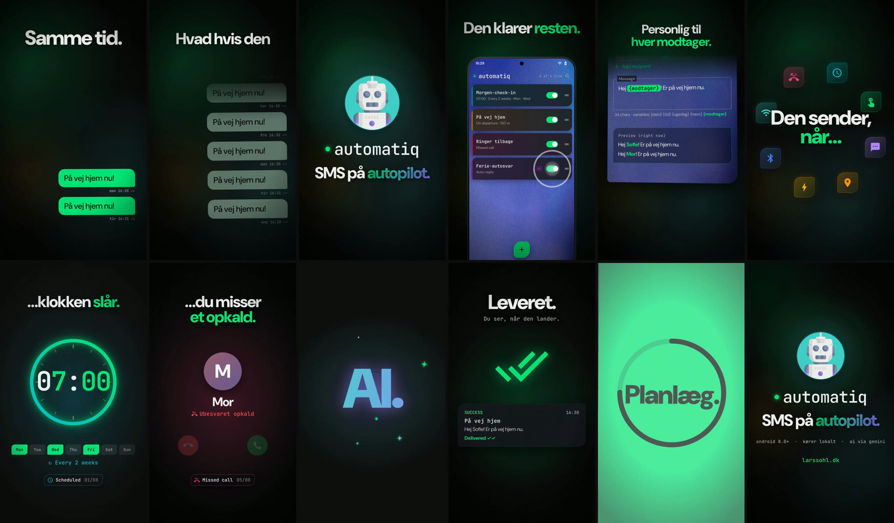
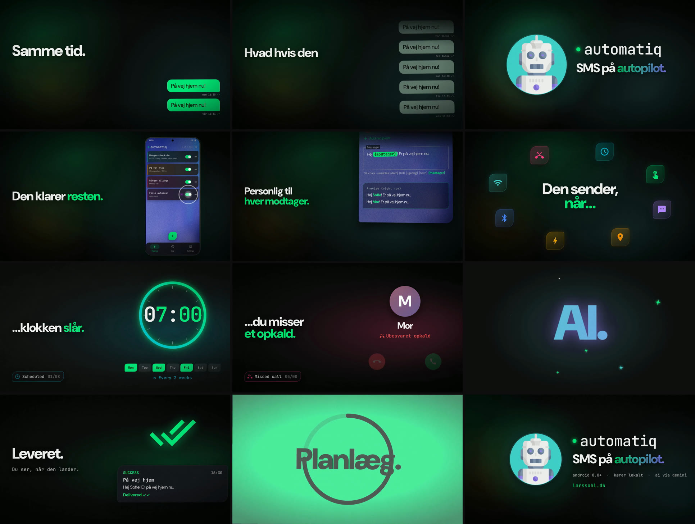

# Automatiq — 60 sek. promo

Samme film i to formater og to længder, alle 60 fps · H.264 + AAC · 80 BPM:

| Fil | Format | Længde | Til |
|---|---|---|---|
| **`out/automatiq-promo-60s-1080x1920.mp4`** | 9:16 lodret | 60,0 s | Reels, TikTok, Shorts, stories |
| **`out/automatiq-promo-60s-1920x1080.mp4`** | 16:9 vandret | 60,0 s | YouTube, website, præsentationer, LinkedIn |
| **`out/automatiq-promo-15s-1080x1920.mp4`** | 9:16 lodret | 15,0 s | korte annoncer, stories, pre-roll |
| **`out/automatiq-promo-15s-1920x1080.mp4`** | 16:9 vandret | 15,0 s | bannere, website-hero, korte annoncer |





En ung, beat-klippet præsentation af appen til Reels/TikTok/Shorts. Hvert klip, hver tekst-slam og
hver lydeffekt sidder på et 80 BPM-grid: 1 beat = 0,75 s, 1 takt = 3 s, 20 takter = 60 s.
Billede og lyd læser **samme tidslinje** (`timeline.js`), så en overgang og den whoosh, der sælger
den, kan ikke glide fra hinanden.

**16:9 er komponeret om, ikke sat på sort.** Teksten står venstrejusteret i en kolonne til venstre
(lodret centreret efter de rigtige skrifttypemål), og appen, chatten, kortene og telefonen står til højre.
Logo, trigger-intro, AI-reveal, recap og slutbillede er egne kompositioner: robotten ved siden af
teksten i stedet for over den, triggerikonerne i en ellipse i stedet for en cirkel, kortet med
placeringen som kort over hele billedet. Tid, klip, musik og lydeffekter er identiske i begge formater,
så lyden er den samme fil.

**15-sekunders-versionen viser kun kernefunktionen**: byg én makro → den sender selv, når noget sker →
leveret. 20 beats på samme 80 BPM-grid (5 takter), og trommerne spiller allerede på beat 0, så første
slag er drop'et:

| Tid | Beats | Scene |
|---|---|---|
| 0:00 | 0–2 | Logo-slam: *automatiq — SMS på autopilot* (logoet i dobbelt tempo, starter lige efter slaget så forsidebilledet viser robotten) |
| 0:01,5 | 2–6 | *Byg en makro.* (editoren i dobbelt tempo: navn, modtagere, besked med `{modtager}`) → *Den sender, når…* |
| 0:04,5 | 6–14 | Fire triggere, 2 beats hver: *…klokken slår* · *…du trykker én gang* · *…nogen skriver til dig* · *…du forlader kontoret* |
| 0:10,5 | 14–16 | *Leveret.* med ✓✓ |
| 0:12 | 16–20 | Slutkort med logo og *SMS på autopilot.* |

Lydeffekterne er ikke skrevet om: hver effekt hos de genbrugte scener er kopieret fra hovedfilmen og
flyttet med scenen (og skaleret med dens tempo), så overgangen og den lyd, der sælger den, bliver
sammen. Musikken har sit eget femtakters arrangement uden opbygning.

Alt er genereret fra kode: UI'et er genskabt fra appens Compose-kilder (leaf-cut-kort med åndende
åre, grøn/amber ThemedSwitch, mono-wordmark med puls-prik, blob-FAB, den kornede blå-violette
baggrund), og musik + lydeffekter er syntetiseret fra bunden (ingen samples, ingen licenser).

## Storyboard

| Tid | Beats | Scene | Tekst | Overgang ind / effekt | Lyd |
|---|---|---|---|---|---|
| 0:00 | 0–4 | Hook: samme SMS hober sig op | *Samme SMS. Samme tid. Hver. Eneste. Dag.* | bobler på 4-, 8- og 16-dele | pops der stiger i tone |
| 0:03 | 4–8 | Glitch-freeze, implosion til puls-prikken | *Hvad hvis den sendte sig selv?* | glitch + RGB-split, sug | glitch, riser, hjerteslag, stilhed |
| 0:06 | 8–12 | **Drop A**: logo-slam | *automatiq — SMS på autopilot.* | hvidt flash, shockwave, partikler | impact + 808 |
| 0:09 | 12–16 | Appen: makrolisten, kort nr. 4 tændes | *Byg en makro. Den klarer resten.* | zoom gennem robottens pupil → app-baggrund | zoom-whoosh, ticks, switch |
| 0:12 | 16–24 | Editoren: navn, modtagere, besked, `{modtager}` | *Giv den et navn. Vælg modtagere. Skriv beskeden. Personlig til hver modtager.* | FAB-blobben vokser til fuld skærm | typing, decode, dropdown-ticks |
| 0:18 | 24–40 | *Den sender, når…* + de 8 triggere (2 beats hver) | *…klokken slår / …du trykker én gang / …nogen skriver til dig / …du forlader kontoret / …du misser et opkald / …du kobler til / Otte triggere. Nul stress.* | dyk ind i ikon, whip-pan, push, zoom-through, kamerastød, strobe | ding, tap, send, sonar, vibration, plug/BT/Wi-Fi |
| 0:29 | 39–40 | Tape-stop + CRT-sluk | | billedet klemmes til en streg og en prik | tape-stop, CRT-zap |
| 0:30 | 40–48 | AI-break | *Og så… AI. · AI svarer for dig. · Du har det sidste ord. · Ny tekst hver gang.* | gnist, flip, fan-out, sug mod linsen | sparkle, shimmer, notification, riser |
| 0:36 | 48–64 | **Drop B**: 8 features à 2 beats | *Leveret. · Stille timer. · Widgets. · Mapper. · Health-tjek. · Overlever genstart. · Smarte variabler. · Backup.* | whip, slices, zoom-through, glitch, iris, push, terning | checks, chime, power down/up, decode |
| 0:48 | 64–72 | Tillid (musikken bag en væg) | *Alt kører på din telefon. Ingen konto. Ingen server. AI kun, hvis du vil.* | telefonen spinner og dykker | thud, switch, riser |
| 0:54 | 72–76 | Recap på hvert beat | *Planlæg. Svar. Automatisér. Slap af.* | farveblokke klippet på beatet | fire hits |
| 0:57 | 76–80 | End card | *automatiq · SMS på autopilot. · larssohl.dk* | impact, ringe | sidste akkord + hjerteslag |

Musikken: trap i C-mol, 80 BPM (Cm9 · Ab · Eb · Bb), 808 med glides, clap på 2 og 4, rullende
hi-hats, pad, FM-pluck-hook og lead i drop B. Der er kick på 1 og 3 i alle groove-takter, fordi
billedet klipper dér. Stille "gaps" på ½ beat før hvert drop. 41 forskellige syntetiserede
lydeffekter fordelt på 119 cues; musikken duckes automatisk under effekterne (sidechain), så
overgangene altid står igennem. Mastereret til −14 LUFS integreret (true peak −1,2 dBTP før AAC).

## Struktur

```
promo/
  timeline.js            fælles tidslinje: 28 shots, sektioner, trommegrid, gaps, 119 SFX-cues (beats)
  timeline-short.js      15 s-klippet: 8 shots og de samme SFX-cues, afledt af timeline.js
  scene/                 deterministisk HTML-renderer: window.renderFrame(t)
    index.html, style.css   ?f=land skifter til 1920×1080 (ellers 1080×1920)
    lib.js               easing, springs, seeded noise, kinetisk typografi
    ui.js                appens UI genskabt (MacroCard, ThemedSwitch, telefon, widget …)
    shots.js             hjælpere: captions, overgange, SH.vis/place/map (placering i 16:9)
    shots-*.js           de 28 shots, ét pr. tidslinje-indgang
    main.js              shot-scheduler, kamera (kick-puls, rystelse), flash, glitch, grain
  audio/
    dsp.py               oscillatorer (polyBLEP), filtre, reverb, delay, limiter
    soundtrack.py        arrangement (60 s og 15 s) + SFX-bibliotek + mix/master → WAV
  render.cjs             Playwright → frames → ffmpeg (x264/AAC) med lyd
  assets/                DM Sans + JetBrains Mono (OFL), robot-ikonet i 3× størrelse
  out/                   færdige videoer (begge formater) og storyboards
```

## Render igen

Krav: Node 18+, Playwright med Chromium (`npm install && npx playwright install chromium` i `promo/`),
Python 3 med `numpy` + `scipy`, og `ffmpeg` med libx264.

```bash
cd promo
node render.cjs                         # 9:16 → out/automatiq-promo-60s-1080x1920.mp4 (ca. 10 min på 4 kerner)
node render.cjs --format 16x9           # 16:9 → out/automatiq-promo-60s-1920x1080.mp4
node render.cjs --cut 15                # 15 s-klippet, 9:16 → out/automatiq-promo-15s-1080x1920.mp4
node render.cjs --cut 15 --format 16x9  # 15 s-klippet, 16:9 → out/automatiq-promo-15s-1920x1080.mp4
node render.cjs --format 16x9 --sheet 18:30:0.375   # kontaktark af et udsnit → build/sheet.png
node render.cjs --preview 6,9.5,36      # enkelte stills → build/preview/
```

Flag: `--format 9x16|16x9`, `--cut 15`, `--fps 60`, `--crf 22` (x264-kvalitet; 22 giver ~30 MB), `--workers 4`,
`--from/--to` (sekunder), `--no-audio`, `--keep-frames`, `--out navn.mp4`.

Skal du ændre noget i begge formater, ret det i `scene/shots-*.js`: visualerne bygges i et fælles
1080×1920-"designrum", og `SH.vis(root, SH.place(...))` placerer det i højre kolonne i 16:9.

Ret tekster i `scene/shots-*.js`, timing og lydeffekter i `timeline.js` (15 s-klippets rækkefølge
står i `PLAN` i `timeline-short.js`), musikken i `audio/soundtrack.py`.

## Licenser

- DM Sans og JetBrains Mono: SIL Open Font License 1.1 (`assets/fonts/OFL-*.txt`).
- Ikoner: Material Icons (Google), Apache License 2.0.
- Robot-ikonet og baggrundsbilledet kommer fra appens egne ressourcer.
- Musik og lydeffekter er syntetiseret i `audio/` og må bruges frit sammen med videoen.
